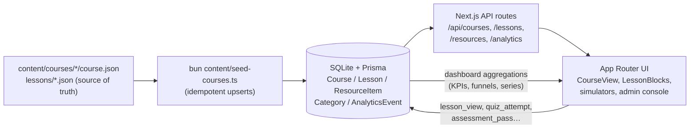

# DevPath — Masterclass → Roadmaps → Courses → Resources → Simulators

> A full-stack developer learning platform where **every published course teaches
> real skills end-to-end**: read the lesson, run the code live in an embedded
> simulator, solve the exercise with progressive hints, prove it in the quiz,
> pass the final assessment, ship the capstone project.


---

## 1. What DevPath actually is

Most tutorial sites are catalogs of descriptions. DevPath is a **course-first
learning engine**:

```
Course → Curriculum (Lessons) → Exercise → Hints → Solution → Quiz
       → Final Assessment → Capstone Project → Interview Q&A
```

Proof, not promises — shipped content in this repo right now:

| Course (`content/courses/<slug>`) | Depth |
|---|---|
| `sql-fundamentals` | **10 lessons**, 49 lesson quiz questions, 12-question final assessment, Engagement-Report capstone, interview Q&A — every query runs live in the SQL Query Sandbox via `practice`-block deep-links |
| `typescript-in-2-hours` | **8 lessons**, 39 quiz questions, 12-question assessment, capstone project, interview Q&A |
| `javascript-basics-refresher` | **8 lessons**, 218 content blocks, 40 quiz questions, 12-question assessment, DevPath Study Pipeline capstone, 6 `js-playground` practice deep-links |
| `git-for-beginners-visual-learning` | **10 lessons**, 250 blocks, 30 diagrams, 40 quiz questions, 12-question assessment, Git Journal capstone, 8 practice blocks deep-linked into the Git History Playground |
| `sql-intermediate` | In progress (`draft`) — Ch.1 *Subqueries: Think in Two Steps* authored; prereq: `sql-fundamentals` |

The catalog holds **85 published courses (+1 draft)** across 7 learning tracks
(Frontend 21 · Backend 27 · Data 7 · DA/DS 3 · AI 9 · SDET 7 · Tools 11) —
see [`docs/COURSE_CATALOG_AUDIT.md`](docs/COURSE_CATALOG_AUDIT.md) for the full
truth table and [`docs/LEARNING_PATHS.md`](docs/LEARNING_PATHS.md) for the
prerequisite graph (`Course.prereqSlugs` renders as links on every course page).

---

## 2. The five content categories

| Category | Route data | What lives there |
|---|---|---|
| Masterclass | `?category=masterclass` | Long-form deep dives (systems design, TS patterns, React at scale…) |
| Roadmaps | `?category=roadmaps` | Step-by-step career paths with hour estimates |
| Courses | `?category=courses` | Mini-courses above — the heart of the platform |
| Resources | `?category=resources` | Cheatsheets & references (SQL, Git, HTTP codes, regex…) |
| Simulators | `?view=simulator&sim=<slug>` | Playable sandboxes below |

## 3. Playable simulators (all in-browser, zero setup)

| Simulator | Slug | What it does |
|---|---|---|
| SQL Query Sandbox | `sql-query-sandbox` | Real query engine against a developers/courses/enrollments dataset; lessons deep-link queries with `?q=` pre-fill |
| JavaScript Playground | `js-playground` | Editor + console + examples; receives `?q=` snippets from JS course practice blocks |
| Git History Playground | `git-history-playground` | Scripted git terminal rendering a **live commit DAG** + classic ASCII `log --graph` |
| HTTP Request Lab | `http-request-response-lab` | Request builder + response inspector + status-code reference |
| Flexbox Simulator | `css-flexbox-simulator` | Visual controls + live preview + generated CSS |

The lesson renderer routes any `practice` block to its simulator through the
registry in `src/lib/simulators.ts` (`PLAYABLE_SIMULATORS`).

---

## 4. How a lesson is built (real format, from this repo)

Content is **structured data, never JSX**. Example — a quiz question inside
`content/courses/sql-fundamentals/lessons/01-tables-rows-first-query.json`:

```json
{
  "q": "Why do experienced developers avoid SELECT * in application code?",
  "options": ["* queries are not allowed over network connections",
              "It ships unnecessary data, hides intent, and breaks silently when the table's column set changes",
              "The planner refuses to use indexes for *",
              "It returns rows in an undefined order"],
  "answer": 1,
  "explain": "Naming columns is a contract: your code keeps working no matter what columns get added later…"
}
```

Every lesson JSON carries: `title, slug, objective, why, minutes, xp`,
`blocks[]` (`h, p, list, callout, code, table, diagram, keytakeaways,
interview, practice`), one `exercise` (`prompt + hints[3] + solution + why`),
`quiz[]`, `summary`, `next`. Every course JSON carries: `subtitle, audience,
outcomes[], prereqSlugs[], technologies[], skills[], assessment[],
passScore (70), project, interviewQs[], version, contentStatus
(draft|review|published)`.

`lessonCount`, `totalMinutes`, `xpTotal` are **computed from lesson rows** —
the codebase never stores them by hand.

---

## 5. Architecture



**Key files**

- `src/lib/courses.ts` — server data layer + defensive JSON parsing
- `src/components/platform/lesson/LessonBlocks.tsx` — block → component renderer
- `src/components/charts/*` — `ChartCard, StatKpi, ProgressRing, ActivityHeatmap…`
- `src/lib/platform.ts` — catalog queries, rate limiting, `getAnalyticsSummary()`, `getAnalyticsDashboard(range)`
- `src/lib/library-store.ts` — zustand-persisted learner library (saved, completions, lesson/assessment records, streaks)

**API surface** (`src/app/api`)

| Route | Purpose |
|---|---|
| `GET /api/categories`, `GET /api/categories/[id]` | Hub + explorer data |
| `GET /api/resources`, `/[id]`, `/bulk` | Catalog CRUD (admin-gated writes) |
| `GET /api/courses/[slug]` | Course meta + computed totals + lesson list |
| `GET /api/courses/[slug]/lessons`, `/lessons/[order]` | Lesson bodies, quizzes, exercises |
| `POST /api/analytics` | Rate-limited event intake (public) |
| `GET /api/analytics` | Legacy summary (admin) |
| `GET /api/analytics?view=dashboard&range=7d\|30d\|90d` | KPIs + deltas + sparklines, engagement series, top courses/simulators, funnel (admin) |

Tracked event types: `category_view, card_click, item_view, search,
simulator_view, challenge_complete, sandbox_deep_link, lesson_view,
lesson_complete, quiz_attempt, assessment_pass`.

---

## 6. Quickstart

Requires **[Bun](https://bun.sh) 1.2+** (package manager + runtime).

```bash
bun install

# create .env:
#   DATABASE_URL="file:./db/dev.db"
#   ADMIN_PASSWORD="choose-a-strong-password"

bunx prisma db push          # create SQLite schema
bun prisma/seed.ts           # categories, catalog, roadmaps, simulators
bun content/seed-courses.ts  # course JSON → DB (re-run after any content edit)

bun run dev                  # http://localhost:3000
```

Production:

```bash
bun run build && bun run start
```

Quality gates (all must pass): `bunx tsc --noEmit` · `bun run lint` ·
`bunx next build`. First-party analytics never break the request path, and
admin writes are gated by `x-admin-key` or the signed `devpath_admin` cookie.

---

## 7. Authoring a new course (one chapter at a time)

1. Scaffold `content/courses/<slug>/course.json` with `contentStatus: "draft"`.
2. Write **one lesson JSON at a time** — 800–2,500 words of blocks, one
   meaningful exercise with 3 hints, 3–5 explained quiz questions.
3. Run `bun content/seed-courses.ts`, open `/?course=<slug>&lesson=1`, read it
   like a learner.
4. Finish with: full assessment (10–20 questions), capstone project spec,
   interview Q&A — then flip to `"published"`.

Conventions: `feat(content): …` for course work, `feat(ui): …` for interface,
`chore(config): …` for tooling; content and UI stay in separate commits.

---

## 8. Docs & roadmap

- [`docs/COURSE_CATALOG_AUDIT.md`](docs/COURSE_CATALOG_AUDIT.md) — 85-course truth table, coverage priorities
- [`docs/LEARNING_PATHS.md`](docs/LEARNING_PATHS.md) — prerequisite graph, take-order paths
- [`docs/WEBSITE_OVERHAUL_PROMPT.md`](docs/WEBSITE_OVERHAUL_PROMPT.md) — the visual/design master spec (tokens → charts → pages → dashboards)

**Now building, in order:** `sql-intermediate` chapters → Home + Courses
explorer visual overhaul → Course detail + Lesson view restyle → My Library
learner dashboard → Admin analytics charts → simulator landing polish.
